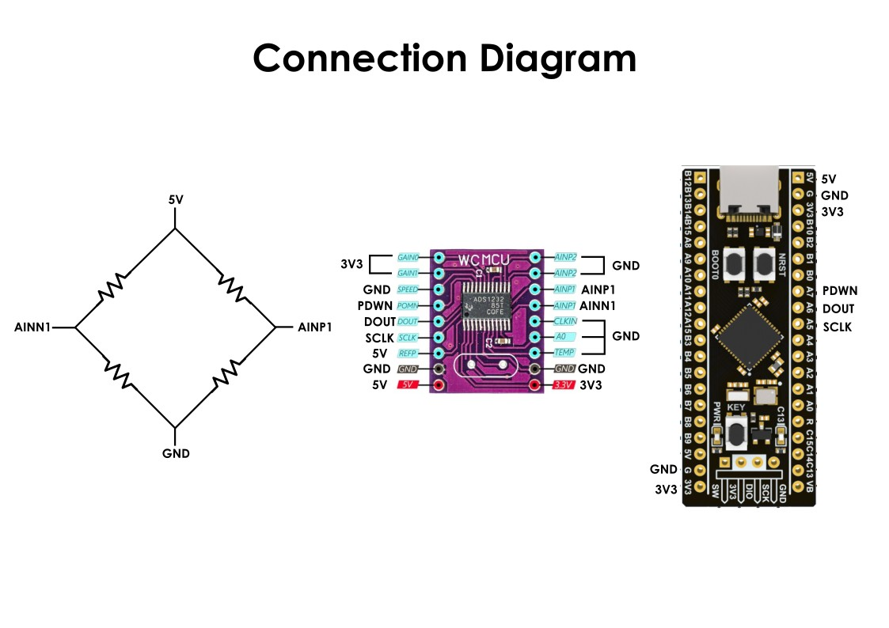

# STM32 ADS1232 Driver

A lightweight, HAL-based driver for the **Texas Instruments ADS1232** — a 24-bit delta-sigma ADC with integrated programmable gain amplifier, designed for bridge sensors like load cells, strain gauges, and pressure sensors.

Written in C, MIT licensed, portable across all STM32 families.

---

## What is the ADS1232?

The ADS1232 is a precision 24-bit ADC that's purpose-built for reading **microvolt-level signals** from Wheatstone bridge sensors. It's the "big brother" of the popular HX711 — same use case (weigh scales), but significantly better in every metric: lower noise, lower drift, internal calibration, programmable gain, and two/four selectable channels.

| | HX711 | **ADS1232** |
|---|---|---|
| Resolution | 24-bit | 24-bit |
| RMS noise (gain 128, 10 SPS) | ~50 nV | **17 nV** |
| 50/60 Hz rejection | ~80 dB | **>100 dB** |
| Channels | 2 (gain-coupled) | **2 (independent)** |
| Gain options | 32, 64, 128 | **1, 2, 64, 128** |
| Internal cal | No | **Yes** |

If you've outgrown the HX711's noise floor, the ADS1232 is the natural upgrade.

---

## Features

- 24-bit raw read with sign extension to `int32_t`
- Selectable PGA gain (1, 2, 64, 128) and data rate (10 / 80 SPS)
- Hardware-triggered offset calibration
- Tare + scale-factor calibration for weigh-scale apps
- Sample averaging helpers (moving-average filter)
- Standby (~100 µA) and full power-down (~0 µA) modes
- Only **3 MCU pins** required (SCLK, DRDY/DOUT, PDWN)
- Portable across STM32 F0, F1, F4, L0, L4, G0, G4, H7, …
- No external clock, no SPI peripheral, no DMA — just GPIO

---

## Wiring Diagram




### MCU ↔ ADC Connections

Only three signal lines plus power:

| STM32 Pin | ADS1232 Pin | Direction | Function |
|---|---|---|---|
| GPIO Output | **SCLK** (pin 23) | → | Serial clock |
| GPIO Input  | **DRDY/DOUT** (pin 24) | ← | Data ready + data output (multiplexed) |
| GPIO Output | **PDWN** (pin 22) | → | Power-down, active low |
| 3V3 | DVDD (pin 1) | — | Digital supply (match MCU level) |
| 5V  | AVDD (pin 18) | — | Analog supply |
| GND | AGND, DGND (pins 2, 5, 6, 17) | — | Ground (star-connect at ADC) |

The remaining pins (GAIN, SPEED, A0, TEMP, CLKIN/XTAL1) are **hardware-strapped** on the PCB — see configuration tables below.

---

## Hardware Configuration

These pins are tied directly to VCC or GND on the PCB. They configure ADC behavior at boot and don't change at runtime.

### PGA Gain — Pins GAIN1 (20), GAIN0 (19)

The gain stage determines your input full-scale range. **Higher gain = smaller signals you can resolve**.

| GAIN1 | GAIN0 | Gain | Full-Scale Input *(VREF = 5 V)* | Typical Use |
|:-:|:-:|:-:|:-:|---|
| GND | GND | **1**   | ±2.5 V       | Voltage measurement, single-ended signals |
| GND | VCC | **2**   | ±1.25 V      | Mid-level differential signals |
| VCC | GND | **64**  | ±39 mV       | Strain gauges, RTD, thermocouples |
| VCC | VCC | **128** | **±19.5 mV** | **Load cells (most common)** |

> **Common-mode constraint**: at gain 64 or 128, the input common-mode voltage must stay within `AGND + 1.5 V` to `AVDD − 1.5 V`. For ratiometric bridge measurement (where the ADC sees mid-supply), this is automatically satisfied.

**How to pick a gain:**
- Load cell with 2 mV/V sensitivity + 5 V excitation → FS bridge output = 10 mV → **use gain 128** (FSR ±19.5 mV gives ~50% headroom)
- 3 mV/V load cell + 5 V excitation → FS = 15 mV → still gain 128
- Reading a 0–2.5 V single-ended signal → gain 1

### Data Rate — Pin SPEED (21)

| SPEED | Data Rate | RMS Noise *(gain 128)* | 50/60 Hz Rejection | Use Case |
|:-:|:-:|:-:|:-:|---|
| GND | **10 SPS** | 17 nV | >100 dB | **Static weighing (recommended)** |
| VCC | 80 SPS     | 44 nV | Lower | Dynamic measurement, faster response |

The 10 SPS mode is special: its sinc⁴ filter places notches at every multiple of 10 Hz, **simultaneously rejecting both 50 Hz and 60 Hz** line interference by over 100 dB. This is why precision scales use this rate even when faster is possible.

### Input Channel — Pins TEMP (7), A0 (8)

Selects which differential input pair the ADC reads from:

| TEMP | A0 | Selected Input |
|:-:|:-:|---|
| GND | GND | **Channel 1** — AINP1 / AINN1 |
| GND | VCC | Channel 2 — AINP2 / AINN2 |
| VCC | X   | Internal temperature sensor |

> **About the temperature sensor**: produces ~111.7 mV at 25 °C with a 379 µV/°C coefficient. **Only works with gain 1 or 2** — gain 64/128 will saturate. Useful for compensating bridge temperature drift, not as a primary thermometer.

**For dynamic channel switching** (e.g., reading channels 1 and 2 alternately): toggle the A0 pin at runtime and wait for 4 conversion cycles for the digital filter to fully settle. Discard the first 4 readings after the switch.

### Clock Source — Pins CLKIN/XTAL1 (3), XTAL2 (4)

| Setup | CLKIN/XTAL1 | XTAL2 | Source |
|---|---|---|---|
| **Internal oscillator** *(recommended)* | GND | NC | 4.9152 MHz, ±3% accuracy |
| External crystal | Crystal | Crystal | 4.9152 MHz parallel-resonant |
| External clock | Driven by MCU | NC | Any 0.2 – 8 MHz |

The internal oscillator is accurate enough for >100 dB line rejection — no crystal needed for most apps.

---

## Operating Voltages

| Rail | Min | Recommended | Max | Notes |
|---|:-:|:-:|:-:|---|
| **AVDD** (analog) | 2.7 V | **5.0 V** | 5.3 V | 5 V optimal for noise & FSR |
| **DVDD** (digital) | 2.7 V | **3.3 V** | 5.3 V | Match MCU logic level |
| **VREF** | 1.5 V | **= AVDD** | AVDD + 0.1 V | Tie to AVDD for ratiometric measurement |
| AGND ↔ DGND | −0.3 V | 0 V | +0.3 V | Connect at single star point near ADC |

### Why ratiometric? (VREF = AVDD)

For bridge sensors, the output is proportional to the excitation voltage:

```
V_bridge = sensitivity × V_excitation
```

If you use the same supply for **both** the bridge excitation and the ADC reference, any drift in that supply cancels out — the reading stays accurate. This is called **ratiometric measurement** and it's why precision scales don't need a precision reference.

```
Code = V_bridge × 2^23 × Gain / (0.5 × V_REF)
     = sensitivity × V_exc × 2^23 × Gain / (0.5 × V_exc)
     = sensitivity × 2^23 × Gain × 2     ← V_exc cancels!
```

### Decoupling (Don't Skip This)

Place these caps as close as possible to the IC pins:

| Cap | Between | Type | Why |
|---|---|---|---|
| 0.1 µF | AVDD ↔ AGND | X7R ceramic | Analog supply decoupling |
| 0.1 µF | DVDD ↔ DGND | X7R ceramic | Digital supply decoupling |
| 0.1 µF | REFP ↔ AGND | X7R ceramic | Reference noise filter |
| **0.1 µF** | **Pin 9 ↔ Pin 10 (CAP)** | **C0G ceramic** | **PGA output filter (critical)** |

The CAP-pin capacitor is required — it forms a 720 Hz low-pass filter with the internal 2 kΩ resistor that band-limits the PGA output before the modulator. Use C0G dielectric for best linearity.

---

## Installation

### STM32CubeIDE / CubeMX-generated project

1. Copy `ads1232.h` to `Core/Inc/`
2. Copy `ads1232.c` to `Core/Src/`
3. Open `ads1232.h` and change the HAL include to match your STM32 family:

   ```c
   #include "stm32f4xx_hal.h"   // change to your family
   ```

   Common values:
   - `stm32f1xx_hal.h` (F103, F107, …)
   - `stm32f4xx_hal.h` (F401, F411, F407, …)
   - `stm32g0xx_hal.h` (G031, G071, …)
   - `stm32l4xx_hal.h` (L432, L476, …)
   - `stm32h7xx_hal.h` (H743, H750, …)

### CMake-based projects

Add to your `CMakeLists.txt`:

```cmake
target_sources(${PROJECT_NAME} PRIVATE
    drivers/ads1232/ads1232.c
)
target_include_directories(${PROJECT_NAME} PRIVATE
    drivers/ads1232
)
```

---

## CubeMX GPIO Setup

In **STM32CubeMX → Pinout & Configuration**, configure three pins:

| Function | Mode | Pull | Output Speed |
|---|---|---|---|
| SCLK | GPIO_Output (Push-Pull) | No pull | Low |
| PDWN | GPIO_Output (Push-Pull) | No pull | Low |
| DRDY/DOUT | GPIO_Input | No pull | — |

> The DRDY/DOUT pin doesn't need a pull resistor — the ADC drives it push-pull. SCLK output speed can stay "Low" since the protocol runs at ~500 kHz max.

Click **Generate Code**, then proceed to the quick start below.

---

## Quick Start

```c
#include "ads1232.h"

/* Pin definitions matching your wiring */
static ads1232_t adc = {
    .sclk_port = GPIOA, .sclk_pin = GPIO_PIN_5,
    .dout_port = GPIOA, .dout_pin = GPIO_PIN_6,
    .pdwn_port = GPIOA, .pdwn_pin = GPIO_PIN_7,

    /* Match your hardware strap pins */
    .gain  = ADS1232_GAIN_128,
    .speed = ADS1232_SPEED_10SPS,
    .vref  = 5.0f,
};

int main(void)
{
    HAL_Init();
    SystemClock_Config();
    MX_GPIO_Init();

    /* Power up + run sequence per Fig 7-15 of datasheet */
    ads1232_init(&adc);

    /* Optional: trigger internal offset calibration (~801 ms at 10 SPS) */
    ads1232_calibrate_offset(&adc);

    /* Optional: tare (set current reading as zero) */
    ads1232_tare(&adc, 10);

    while (1) {
        float voltage;
        if (ads1232_read_voltage(&adc, &voltage, 200)) {
            printf("V = %.6f mV\r\n", voltage * 1000.0f);
        }
        /* Loop will idle ~100 ms in waitReady at 10 SPS */
    }
}
```

### Weigh-Scale Example

```c
/* 1. Calibration phase (do once, save offset & scale to flash) */
ads1232_tare(&adc, 10);                    // tare with no load
HAL_Delay(2000);
/* User places known 1 kg weight */
int32_t raw_1kg;
ads1232_read_raw_avg(&adc, 10, &raw_1kg, 500);
ads1232_set_scale(&adc, raw_1kg, 1000.0f); // 1000 grams

/* 2. Runtime: read weight in grams */
while (1) {
    float weight_g;
    if (ads1232_read_weight(&adc, &weight_g, 4, 500)) {
        printf("Weight: %.2f g\r\n", weight_g);
    }
}
```

---

## API Reference

### Initialization & Power

| Function | Description |
|---|---|
| `ads1232_init(dev)` | Pin setup + power-up sequence. Call once at boot. |
| `ads1232_power_up(dev)` | Manually run power-up sequence (Fig 7-15). |
| `ads1232_power_down(dev)` | Enter full power-down (~0 µA). |
| `ads1232_enter_standby(dev)` | Low-power standby (~100 µA). |
| `ads1232_exit_standby(dev)` | Wake from standby. First data valid after ~52 ms (80 SPS) or ~402 ms (10 SPS). |

### Data Reading

| Function | Description |
|---|---|
| `ads1232_data_ready(dev)` | Returns `true` if DRDY/DOUT is LOW (data ready). |
| `ads1232_wait_ready(dev, timeout_ms)` | Block until ready or timeout. Returns `false` on timeout. |
| `ads1232_read_raw(dev)` | Read 24-bit two's complement, sign-extended to `int32_t`. |
| `ads1232_raw_to_volts(dev, raw)` | Convert raw code to volts. |
| `ads1232_read_voltage(dev, &v, timeout)` | Combined wait + read + convert. |
| `ads1232_read_raw_avg(dev, n, &avg, timeout)` | Averaged read for noise reduction. |

### Calibration & Weigh-Scale

| Function | Description |
|---|---|
| `ads1232_calibrate_offset(dev)` | Hardware-triggered offset calibration. |
| `ads1232_tare(dev, n_samples)` | Set current reading as zero. |
| `ads1232_set_scale(dev, raw, weight)` | Calibrate scale factor from known weight. |
| `ads1232_read_weight(dev, &w, n, timeout)` | Read weight in calibrated units. |

---

## Performance Reference

At AVDD = VREF = 5 V, gain = 128, 10 SPS:

| Metric | Value |
|---|---|
| Resolution | 24 bits |
| Effective resolution (RMS) | 21.1 bits |
| Noise-free resolution | 18.4 bits (≈ 85 000 counts) |
| Noise-free resolution (with 4× moving avg) | 19.1 bits (≈ 135 000 counts) |
| LSB weight | 2.328 nV |
| Full-scale range | ±19.531 mV |
| RMS noise | 17 nV |
| Peak-to-peak noise | 110 nV |
| 50/60 Hz rejection | >100 dB |
| Offset drift | ±10 nV/°C |
| Gain drift | ±2.5 ppm/°C |
| Total power | ~13 mW @ 5 V |
| Standby current | ~100 µA |
| Power-down current | ~0.2 µA |

---

## Common Applications

This driver suits any project that reads a small differential signal from a bridge sensor:

- **Load cells / weigh scales** — kitchen, bathroom, industrial, retail
- **Strain gauges** — structural monitoring, force measurement, torque sensors
- **Pressure sensors** — both invasive (in-line) and non-invasive (pipe-clamp FSR)
- **Resistive thermometers (RTD)** with bridge configuration
- **Custom sensor front-ends** needing nanovolt-level resolution

---

## Troubleshooting

<details>
<summary><strong>Always reads 0x000000 or 0xFFFFFF</strong></summary>

- PDWN is held LOW → check power-up sequence completed
- SCLK not connected or not toggling → scope it
- CLKIN/XTAL1 not tied to GND when using internal oscillator
- Wrong include path for HAL header (compilation might pass but linkage fail)
</details>

<details>
<summary><strong>Readings are noisy / unstable</strong></summary>

- Missing 0.1 µF C0G cap on CAP pins (9–10) — this is **required**
- Insufficient decoupling on AVDD/DVDD/REFP
- AGND and DGND not tied at a single star point near the ADC
- Digital traces routed too close to analog inputs or reference
- No shielded cable on long bridge connections
- Switching power supply ripple → use LDO for AVDD
</details>

<details>
<summary><strong>DRDY never goes low</strong></summary>

- Power-up sequence not run — call `ads1232_init()` first
- Wake-up time not elapsed: ~400 ms at 10 SPS, ~52 ms at 80 SPS
- Clock source mismatch (e.g., crystal pins floating)
- Verify pin direction in CubeMX: SCLK output, DOUT input
</details>

<details>
<summary><strong>Calibration takes "forever"</strong></summary>

- `ads1232_calibrate_offset()` blocks for ~801 ms at 10 SPS — this is normal
- If it never returns: same checks as "DRDY never goes low"
</details>

<details>
<summary><strong>Reading drifts with temperature</strong></summary>

- Run `ads1232_calibrate_offset()` periodically (every few minutes or on temp change)
- For high-precision apps, use the on-chip temperature sensor to compensate
- Check bridge wiring — copper wires have ~4000 ppm/°C resistance change
</details>

---

## Hardware Design Tips

- **Star-ground at the ADC**: tie AGND and DGND together at a single point right under the IC
- **Ground plane**: dedicate one PCB layer to ground, don't route signals on it
- **Kelvin connections** for bridge excitation: if the bridge is far from the ADC, sense REFP/REFN at the bridge itself, not at the supply
- **Avoid long DRDY/DOUT traces**: high capacitance increases noise. Add a 100 Ω series resistor if needed
- **Shield**: enclose the bridge wiring in shielded cable, ground the shield at the ADC end only

---

## References

- [ADS1232 Datasheet (SBAS350H, June 2025)](https://www.ti.com/lit/ds/symlink/ads1232.pdf)
- [TI E2E Forum — Data Converters](https://e2e.ti.com/support/data-converters-group/data-converters/)
- [Application Note: Bridge Sensor Front-End Design (SLOA034)](https://www.ti.com/lit/an/sloa034/sloa034.pdf)

---

## License

MIT — see [LICENSE](LICENSE) for details. Use it however you like.

## Contributing

Pull requests welcome. If you find a bug, please open an issue with:
- STM32 family/part number
- HAL version
- Minimal reproduction code

---

Made for the embedded community.
